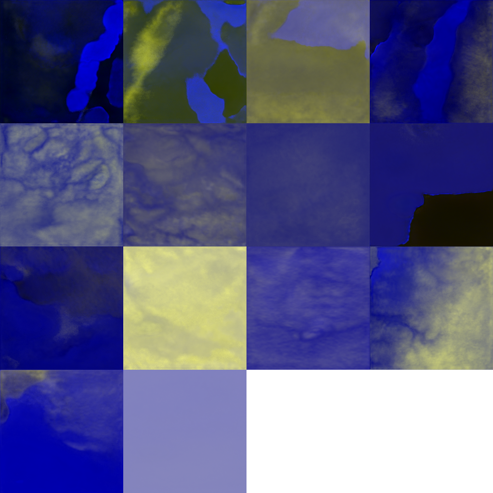
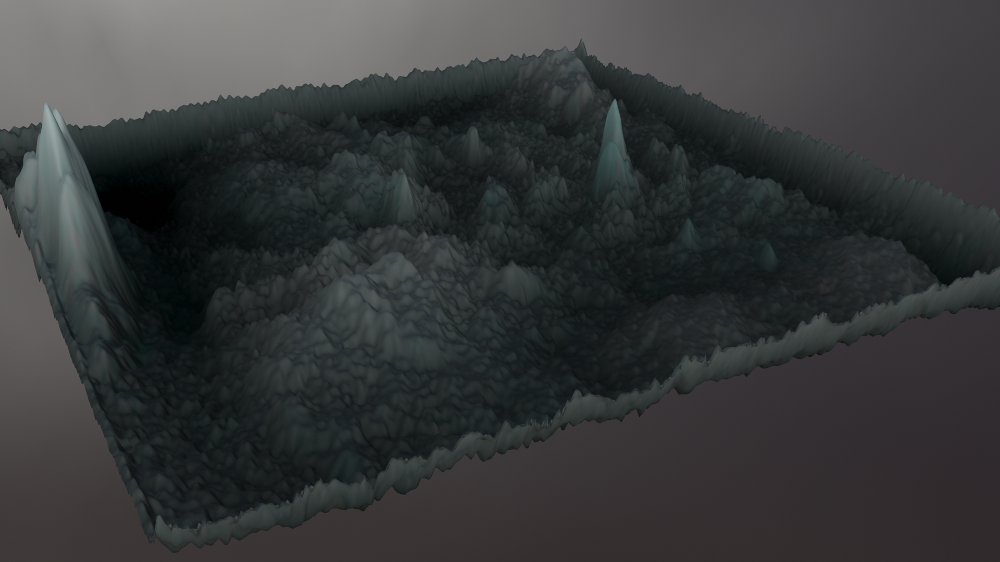
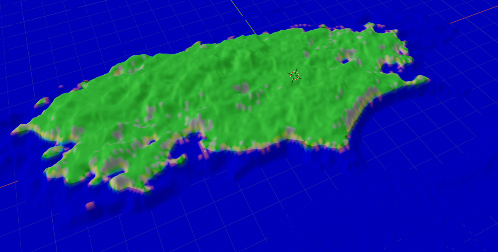
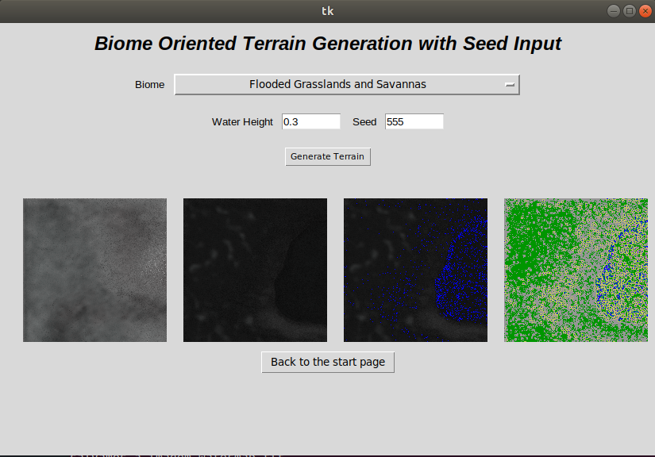
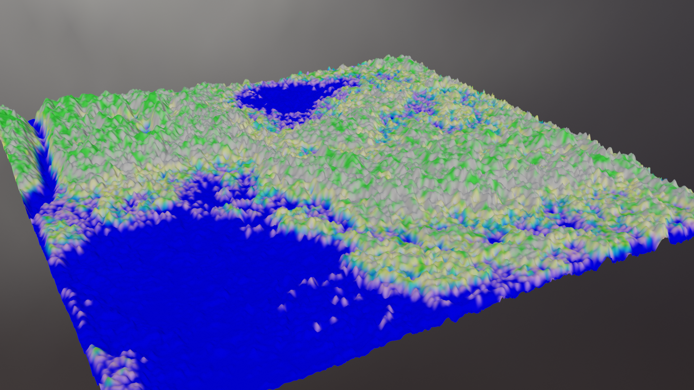
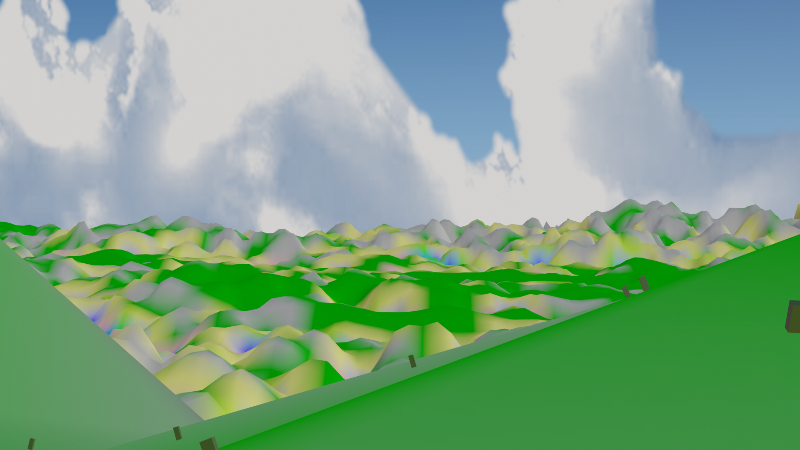
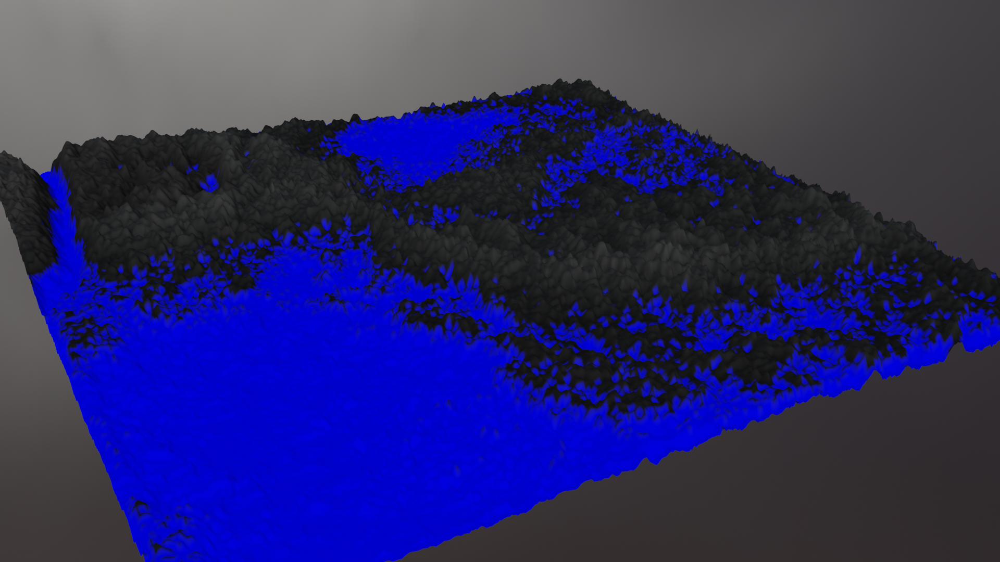

# styleterrain
Tags: 
Virtual Realistic and Large Terrain Generation via Machine Learning}{Procedural Terrain Generation, PCG, Procedural Content Generation, PTG, ML, Machine Learning, StyleGAN, Style Transfer

Abstract:
    This work has the objective of exploring GANs (Rede Generativas Adversariais) in relation to their efficiency in resolving well known problems in the area of PTG (Procedural Terrain Generation), like the lack of a mechanism to rate the terrains generated and of methos that replicate complex geological structures specific to certain biomes. An application was developed in order to generate large terrains (more than a hundred miles per tile) which greatly resemble reality, even more if seen as a whole, due to the focus in big geological structures of a terrain.
    With the generative network obtained through training and with the help of other detailing tool that were built, an application was developed named StyleTerrain, which aims to help with the work of designers that may need to generate realistic environments with big dimensions to be used in nature environment simulations and digital games that need vast outdoor environments. This tools makes the designer able to easily generate terrains with 189x189 kilometers, with height structures and ground specific to a certain biome, that can easily be rendered in a adequate 3D software.
    Its strength lies in realistic simulation of natural environments and digital games whom need to utilize large open outdoor maps without overloading its content designers.

Screenshots:

Complete paper:
https://lume.ufrgs.br/handle/10183/198604
